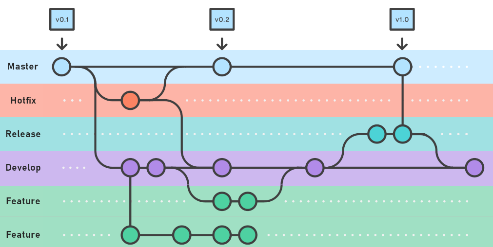
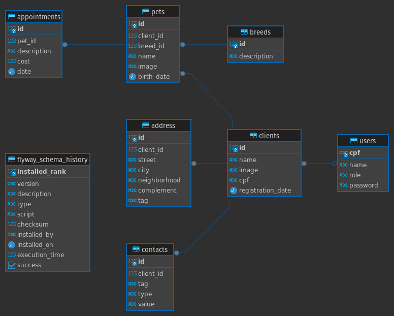

# Documentação do Processo de Desenvolvimento

Este documento visa garantir que todos os passos do processo de desenvolvimento estejam bem documentados para facilitar a manutenção e a continuidade do projeto.

Algumas das automações para o desenvolvimento desse sistema foram projetadas para linux, então em caso de uso em windows alguns desses processos podem conter falhas, entre esses processos está o de geração de containers.

---

### Inicialização do Projeto

- **Plataforma**: O projeto foi inicializado utilizando a plataforma [Spring Initializr](https://start.spring.io).

---

### ASDF

Para garantir que o sistema se mantenha executando nas versões adequadas, foi implementado o **ASDF** para a gestão das versões do Gradle e do Java. As versões podem ser vistas no arquivo `.tool_versions`.

---

### Bibliotecas

- **Spring Web**: Para criar o projeto web e os endpoints RESTful.
- **Spring Data JPA**: Para mapear as entidades com o banco de dados.
- **Flyway Migration**: Para gerenciar as migrações de banco de dados.
- **PosrgeSQL Driver**: Para conectar com o banco de dados PostgreSQL.
- **Spring Boot DevTools**: Para facilitar o desenvolvimento.
- **Spring Boot Test**: Para realizar os testes com JUnit.
- **Springdoc Openapi Starter Webmvc UI**: Para documentar a api.
- **Actuator**: Para gerar métricas.
- **Mapstruct**: Para fazer mapeamento de entidades para DTO.

---

### Banco de dados instalado nativamente

Para este projeto optei para que os bancos de dados se mantenham instalados nativamente na maquina de destina, visando evitar perdas de dados de forma
inesperada, problema que pode ocorrer em aplicações que usam bancos de dados em container, o nome padrão para database é `petshop`.

---

### Execução

Para simplificação, preparei um arquivo `launch.json` para usuários de **VSCode**, permitindo que os pacotes da aplicação sejam compilados e executados pelo debugger do VSCode, facilitando o processo de debug. Caso não deseje usar dessa forma, a aplicação pode ser executada com o seguinte comando:

```bash
./gradlew bootRun
```

---

### Abstrações

- Evitei abstrações para garantir que o sistema, a longo prazo, possa sofrer alterações relacionadas a cada regra de negócio específica. Portanto, não criei nenhum tipo de `AbstractService` ou `AbstractController`. Devido a essa escolha, foi necessário repetir código, mas isso garante uma boa manutenção a longo prazo.

---

### Paginação

- Devido a possibilidade de grande volume de dados, percebi a importância de uma boa implementação de paginação. Por isso, implementei uma paginação baseada no `Pageable`. Não implementei buscas não paginadas, pois, para as regras de negócio que planejei, isso não faria sentido.

- Para que a documentação se torna-se uso simples, moldei manualmente a aparência do `Pageable` para o swagger exibindo apenas dois campo `page` e `size`.

---

### Testes

- Utilizei o `SpringBootTest` junto com o `Mockito` para realizar todos os testes da aplicação. Todos os dados utilizados nos testes foram fictícios, simulados com `Mockito`, garantindo que qualquer ambiente que execute o teste possa validar se a aplicação está funcionando corretamente, sem alterar o banco de dados.
- Para garantir que os testes abranjam vários cenários, realizei os primeiros testes após o desenvolvimento da primeira versão. Após isso, apliquei a metodologia **TDD** para a inclusão da paginação nos controllers.

---

### Variáveis de Ambiente

- Para garantir flexibilidade e facilidade de configuração, implementei 6 variáveis de ambiente:
  `DB_URL`, `DB_USERNAME`, `DB_PASSWORD`, `ALLOWED_ORIGIN`, `JWT_KEY`, `UPLOAD_DIR`.

---

### Documentação

- Para facilitar a usabilidade, criei uma coleção de requisições no Insomnia e implementei o Swagger na aplicação, disponível na rota
  `/swagger-ui/index.html`.

---

### Banner

- Incluí um banner para melhor adequação ao projeto.

---

### CORS

- Para evitar problemas com políticas de acesso já deixei preparado toda a configuração de CORS da aplicação para suportar a conexão com o Frontend
  por meio da variável de ambiente `ALLOWED_ORIGIN`, caso não definida o padrão será qualquer origem.

---

### META-INF

- incluí uma configuração no `META-INF` para evitar que as propriedades que criei para isso cause qualquer alerta, as propriedades adicionadas
  são essas: `cors.allowed-origin`, `jwt.secret-key` e `upload.path`

---

## Deploy

- Utilize o arquivo docker_compose_prod.yml.
- Utilizei para prepar um deploy para esta aplicação as ferramentas docker e docker compose, ao executar o buildImage.sh ele fará todo o processo de compilação e preparação do pacote, após isso ele irá gerar uma imagem docker com base no nome de pacote presente em settings.gradle e da versão presente em build.gradle, para a imagem de base utilizei a openjdk:21-ea-oraclelinux8, segui para o padrão de versões o similar ao utilizado para o controle de versão do kernel Linux, tendo pacotes LTS e SNAPSHOTS.

### Git Workflow

- Este projeto apresenta este modelo de trabalho



---

### Diagrama de banco de dados



---

### Etapas Concluídas

- **(Concluído)** Fiz a migração inicial da database.
- **(Concluído)** Inclui uma seed de usuário administrador.
- **(Concluído)** Fiz os endpoints RestFul padrões.
- **(Concluído)** Implementei a autenticação via JWT.
- **(Concluído)** Implementei o upload e download de imagem para Cliente e pet.
- **(Concluído)** Implementei as roles de acesso.
- **(Concluído)** Implementei o swagger para documentação.
- **(Concluído)** Implementei as métricas com actuator.
- **(Concluído)** Implementei o deploy da aplicação com docker.
